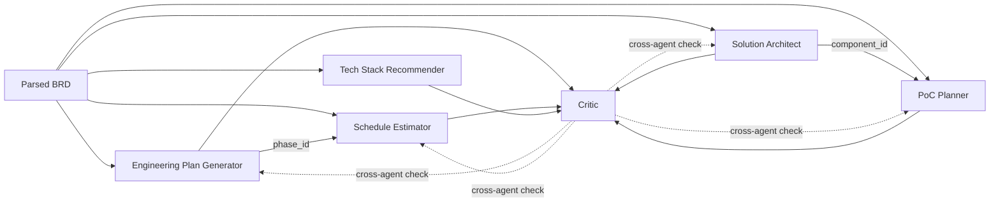

# Agent Contract Reference

Every agent follows one rule: one role → one job → one output contract. All 7 contracts are JSON
Schema (draft-07) files under `schemas/`, validated at every handoff by
`scripts/guardrails.py::validate_schema` (see `docs/guardrails_safety.md` §2). This document is
the map: what each agent produces, what's required, and — critically — who reads it and why,
since a schema in isolation doesn't show the dependency graph that makes cross-agent consistency
checking possible at all.

## Shared Envelope

Every agent output (except `orchestrator_state`, which is a different kind of contract — see §9)
extends the shared envelope in `schemas/common.schema.json` via `allOf`. Defined once, reused
everywhere, so a change to (say) how citations are structured doesn't require editing 7 files.

| Field | Purpose |
| :---- | :---- |
| `agent_id`, `brd_id`, `run_id` | Identity — which agent, which BRD, which orchestration run |
| `revision_number` (0–2) | Tracks position in the Critic's capped revision loop |
| `status` | `draft` \| `revised` \| `final` |
| `citations[]` | `{source_id, source_type, chunk_id, excerpt, similarity_score}` — every non-trivial claim should trace to one of these |
| `assumptions[]` | `{description, reason, conservative_default_applied}` — how ambiguity is documented, not guessed at (`docs/guardrails_safety.md` §7) |
| `ambiguities_flagged[]` | `{field, description, brd_section_ref}` — structured, not a footnote |
| `requirement_ids_addressed[]` | The exact mechanism that makes completeness (nothing missing) and scope-creep (nothing invented) checkable by code rather than inferred from prose |

`citation.source_type` is constrained to the six KB source types (`past_brd`, `plan_template`,
`architecture_pattern`, `project_timeline`, `org_standard`, `tech_stack_decision`) — the same
enum used throughout `docs/rag_design.md`, so a citation always names which part of the KB backs
a claim.

## Dependency Graph (Who Consumes What)

Two dependencies are structural, not just conventional — the Critic checks them exactly, not by
inference (`scripts/critic.py::cross_agent_consistency_checks`):

- **Schedule → Plan**: every `schedule_estimate.effort_estimates[].phase_id` must match a
  `engineering_plan.phases[].phase_id`. `schedule_estimate.aligned_plan_id` records which plan
  revision it was aligned to.
- **PoC → Architecture**: every `poc_plan.modular_boundaries[].maps_to_component_id` must match a
  `solution_architecture.components[].component_id`.

A schedule or PoC that references an id the other agent never produced is a consistency failure,
not a groundedness one — it's checkable without any LLM judgment at all.

## 1. Orchestrator

Not a content-producing agent — it owns state, not a schema in the same sense as the other six.
See §9 (`orchestrator_state.schema.json`) for its actual contract.

## 2. Engineering Plan Generator

**Schema:** `schemas/engineering_plan.schema.json` · **Group:** Planning

| Field | Required | Notes |
| :---- | :---- | :---- |
| `phases[]` | ✅ | `{phase_id, name, sequence, dependencies[]}` — `phase_id` is the join key `schedule_estimate` depends on |
| `risks[]` | ✅ | `{risk_id, description, likelihood, impact, mitigation}` |
| `milestones[]` | ✅ | `{milestone_id, name, phase_id, target_criteria}` |
| `team_composition[]` | ✅ | `{role, count, phase_id}` |
| `reflection_notes` | — | Self-review step output: `self_identified_gaps[]`, `confidence`, `revision_from_previous` — the Reflection pattern called out in BRD Section 4 |

**Consumed by:** Schedule Estimator (via `phase_id`), Critic (all four dimensions), the EM (final
artifact).

## 3. Schedule Estimator

**Schema:** `schemas/schedule_estimate.schema.json` · **Group:** Planning

| Field | Required | Notes |
| :---- | :---- | :---- |
| `aligned_plan_id` | ✅ | Records which plan run/revision this schedule was built against |
| `effort_estimates[]` | ✅ | `{phase_id, effort_person_days, basis}` — `phase_id` must exist in the Plan |
| `timeline[]` | ✅ | `{phase_id, start_offset_days, duration_days}` |
| `resource_allocation[]` | — | `{role, phase_id, allocation_pct}` |
| `variance_notes` | — | Should cite `project_timeline` KB rows for historical variance |

**Consumes:** Engineering Plan Generator's `phases[]` (for `phase_id` validity). **Consumed by:**
Critic (groundedness — did it actually cite `project_timeline` precedent; consistency — does it
reference real phases).

## 4. Solution Architect

**Schema:** `schemas/solution_architecture.schema.json` · **Group:** Design

| Field | Required | Notes |
| :---- | :---- | :---- |
| `pattern_selected` | ✅ | Should trace to an `architecture_pattern` KB citation |
| `components[]` | ✅ | `{component_id, name, responsibility, depends_on[]}` — `component_id` is the join key PoC depends on |
| `data_flow[]` | ✅ | `{from_component_id, to_component_id, data_description, protocol}` |
| `nfr_mapping[]` | ✅ | `{nfr_requirement_id, addressed_by_component_id, explanation}` — ties BRD NFRs to design decisions explicitly, the most direct completeness link of any schema |
| `diagram_mermaid` | — | Mermaid source for the architecture diagram |

**Consumed by:** PoC Planner (via `component_id`), Critic, the EM.

## 5. PoC Planner

**Schema:** `schemas/poc_plan.schema.json` · **Group:** Design

| Field | Required | Notes |
| :---- | :---- | :---- |
| `poc_scope` | ✅ | |
| `out_of_scope[]` | — | Explicit exclusions — what the Critic checks against for scope creep at the PoC-boundary level |
| `success_criteria[]` | ✅ | `{criterion_id, description, measurement, target_value}` — must be quantifiable, checked for actionability |
| `modular_boundaries[]` | ✅ | `{module_id, maps_to_component_id, boundary_description}` — `maps_to_component_id` must exist in the Architecture |
| `estimated_duration_days` | — | |

**Consumes:** Solution Architect's `components[]` (for `component_id` validity). **Consumed by:**
Critic (consistency — do PoC boundaries reference real components), the EM.

## 6. Tech Stack Recommender

**Schema:** `schemas/tech_stack_recommendation.schema.json` · **Group:** Design

| Field | Required | Notes |
| :---- | :---- | :---- |
| `options[]` | ✅ (2–3 items) | `{option_id, stack_name, components[], tradeoffs}` — `tradeoffs` covers `scalability`, `team_familiarity`, `integration_risk`, `cost`, all required |
| `recommended_option_id` | ✅ | Must match one of `options[].option_id` |
| `rationale` | ✅ | Should cite `tech_stack_decision` log entries |

**Consumed by:** Critic (groundedness — does the rationale cite real past decisions; consistency —
does `team_familiarity` contradict the Plan's assumed ramp-up time, per
`docs/guardrails_safety.md` §6), the EM.

## 7. Critic

**Schema:** `schemas/critic_review.schema.json` · **Group:** Validation

| Field | Required | Notes |
| :---- | :---- | :---- |
| `target_agent_id`, `target_output_ref` | ✅ | Which agent/output this review is for |
| `scores` | ✅ | `{groundedness, completeness, consistency, actionability}` — all four required, 0.0–5.0 |
| `overall_score` | ✅ | Average of the four; drives the badge |
| `badge` | ✅ | `green` \| `amber` \| `red` — see `docs/evaluation_report.md` §3 for the exact thresholds |
| `revision_required`, `revision_count` | ✅ | Drives `scripts/orchestrator.py`'s revision loop |
| `dimension_failures[]` | — | `{dimension, reason, specific_feedback}` — the feedback text fed back into the next revision cycle |
| `cross_agent_consistency_checks[]` | — | `{check, passed, detail}` |
| `escalated_to_em` | — | True once `revision_count` hits the cap (2) and a dimension is still failing |

**Consumes:** every Planning/Design agent's output, plus the retrieved chunks and (when available)
the other agents' outputs for cross-agent checks. **Consumed by:** the Orchestrator (to decide
whether to loop, cap, or proceed), the EM (badges + feedback are shown directly, per BRD Section
10's "decision-ready artifacts" goal).

## 8. Parsed BRD (Layer 1 output — input to everything above)

**Schema:** `schemas/parsed_brd.schema.json` — not one of the 7 agents, but the contract every
agent's retrieval and completeness checking depends on.

| Field | Required | Notes |
| :---- | :---- | :---- |
| `brd_id`, `source_hash` | ✅ | `source_hash` is what confidentiality logging uses instead of raw content |
| `file_type`, `validation_status` | ✅ | Set by the input-validation guardrail (`docs/guardrails_safety.md` §1) |
| `sections[]` | ✅ | Each section carries `requirements[]` — `requirement_id` here is the exact string every other schema's `requirement_ids_addressed[]` and `nfr_mapping[].nfr_requirement_id` refer back to |

This is the one contract every downstream schema is implicitly keyed against: completeness
(§ envelope), scope creep, and NFR mapping all resolve to `requirement_id` values defined here and
nowhere else.

## 9. Orchestrator State (not an agent output — the run's shared state)

**Schema:** `schemas/orchestrator_state.schema.json`

| Field | Required | Notes |
| :---- | :---- | :---- |
| `run_id`, `brd_id`, `pipeline_status` | ✅ | `pipeline_status` enum tracks the run through `ingesting → routing → planning → designing → critic_review → revising → evaluating → awaiting_hitl → exporting → complete \| failed` |
| `agent_states[]` | ✅ | `{agent_id, status, attempt_count, last_error, revision_count}` — per-agent execution state |
| `routing_table[]` | — | `{section_id, assigned_agents[]}` — which BRD sections route to which agents |
| `guardrail_events[]` | — | `{type, agent_id, detail, action_taken}` — every guardrail trigger across the whole run, the same shape produced by every check in `scripts/guardrails.py` |

Not consumed by any agent — this is what the Orchestrator itself reads and writes to decide what
to do next, and what `docs/operationalization.md`'s monitoring plan is built to observe.
