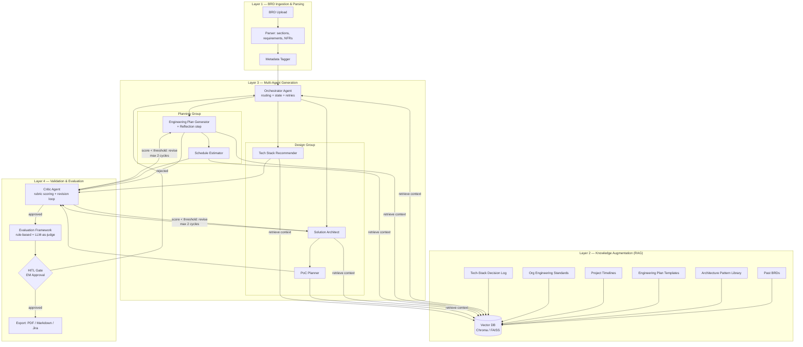
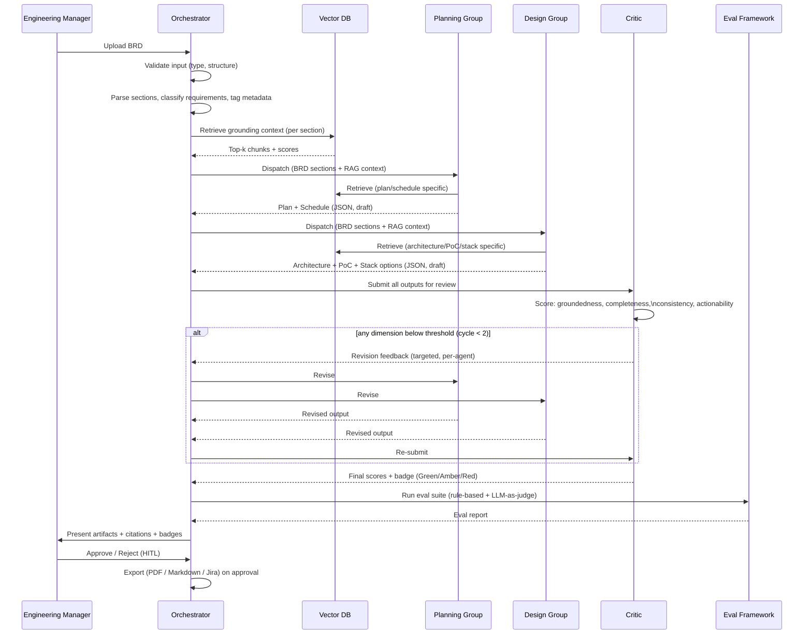
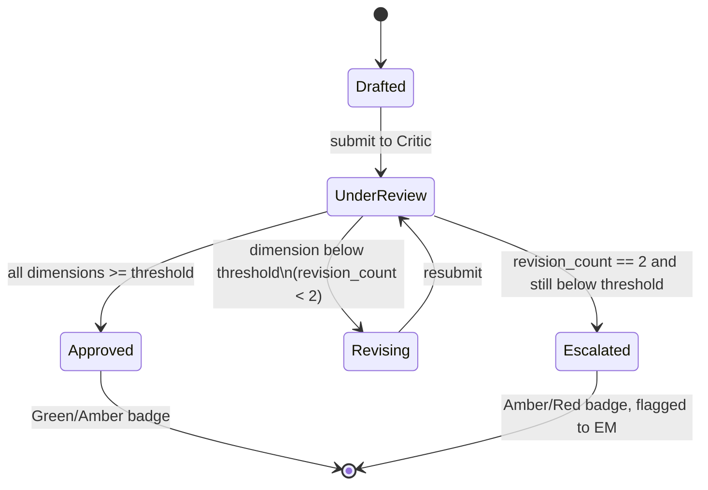

# Architecture Overview — Multi-Agent BRD-to-Engineering System

Orchestration pattern: **hub-and-spoke**. A central Orchestrator Agent owns state, routes work,
retries on failure, and aggregates results. Specialist agents never talk to each other directly —
all coordination flows through the Orchestrator and the shared state store. This keeps the
failure blast radius contained to one spoke, makes retries/timeouts uniform, and gives a single
place to enforce the Critic revision cap and guardrails. If BRD volume scaled to 50+/week, the
Orchestrator would shard by BRD (one orchestrator instance per in-flight BRD, horizontally
scaled) and the RAG store would move from local (Chroma/FAISS) to a managed cloud vector DB
(Pinecone/Qdrant) to handle concurrent read load.

## 1. Layered System Diagram

## 2. Data Flow (Sequence)

## 3. Critic Revision Loop (State Machine)

## 4. Component / Tool Mapping (reference)

| Component | Example Tool Choice |
| :---- | :---- |
| Orchestration | LangGraph (code track) or n8n workflow (low-code track) |
| Vector DB | Chroma / FAISS (local) or Pinecone / Qdrant (cloud) |
| Embeddings | `text-embedding-3-small` (cost) or `text-embedding-3-large` (quality) |
| LLM (generation + judge) | Claude / GPT-4-class model, temperature low for structured output |
| Schema validation | Pydantic (Python) or JSON Schema + ajv (n8n/JS) |
| Export | Markdown renderer, PDF via wkhtmltopdf/pandoc, Jira REST API (mock) |
| Logging | Structured JSON logs, BRD content hashed (SHA-256), never raw-logged |
